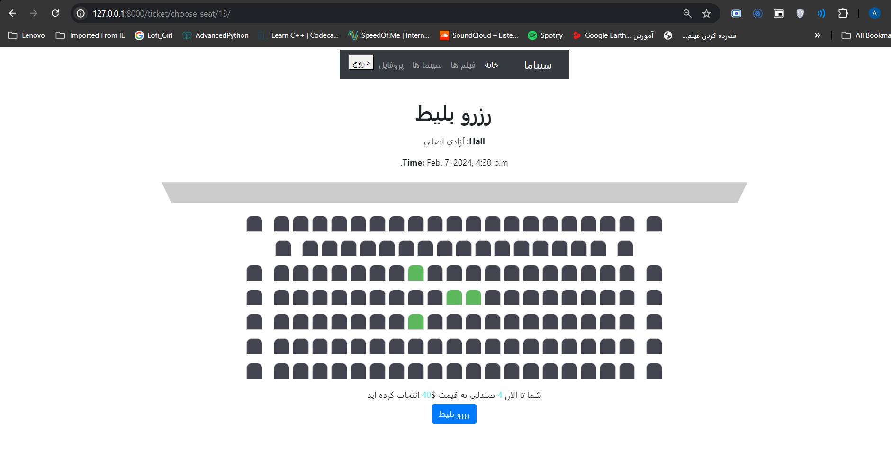
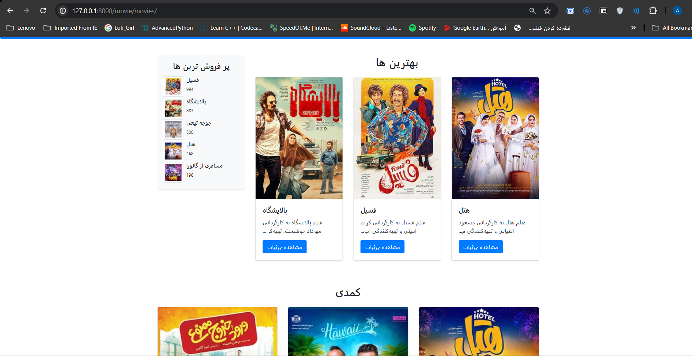
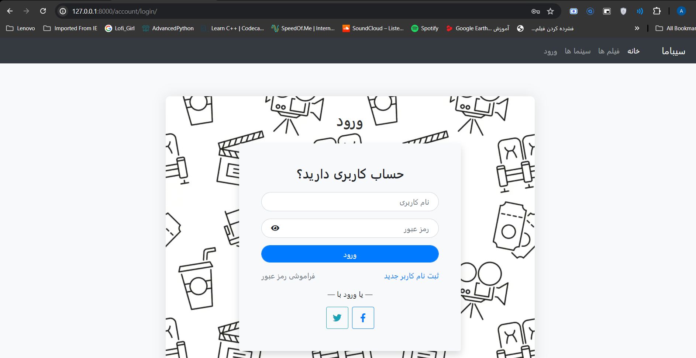
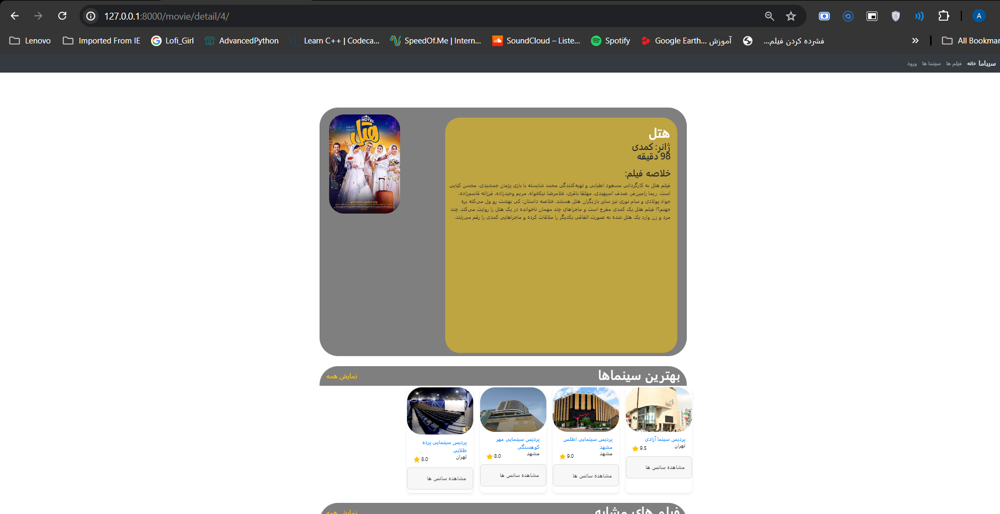
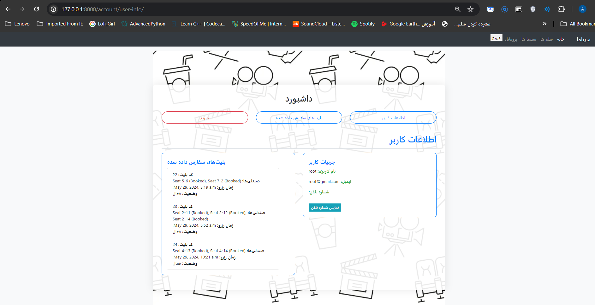
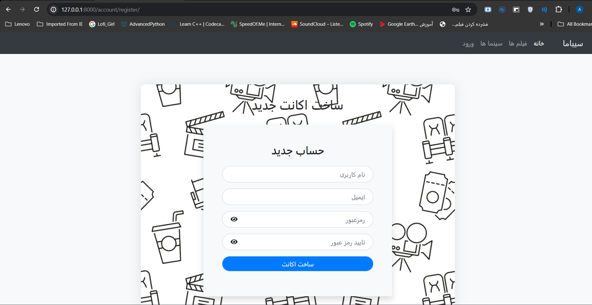

Here's a professional and comprehensive README file for your Django cinema ticket reservation system project:

---

# Django Cinema Ticket Reservation System

A web-based application built with Django to manage cinema ticket reservations. This project provides functionalities to browse movies, select showtimes, reserve tickets, and manage bookings.

## Table of Contents

- [Features](#features)
- [Demo](#demo)
- [Installation](#installation)
- [Usage](#usage)
- [Screenshots](#screenshots)
- [Technologies](#technologies)
- [Contributing](#contributing)
- [License](#license)
- [Contact](#contact)

## Features

- User registration and authentication
- Browse movies and showtimes
- Select and reserve tickets
- View and manage reservations
- Admin interface for managing movies, showtimes, and reservations

## Demo

A live demo of the application is available at [Your Demo URL Here](#).

## Installation

### Prerequisites

- Python 3.x
- Django 3.x
- Virtualenv

### Steps

1. **Clone the repository:**

    ```sh
    git clone https://github.com/Warm-Hearted-Snowman/django-python-cinema-ticket.git
    cd django-python-cinema-ticket
    ```

2. **Create a virtual environment:**

    ```sh
    python -m venv venv
    source venv/bin/activate  # On Windows use `venv\Scripts\activate`
    ```

3. **Install dependencies:**

    ```sh
    pip install -r requirements.txt
    ```

4. **Apply migrations:**

    ```sh
    python manage.py migrate
    ```

5. **Run the development server:**

    ```sh
    python manage.py runserver
    ```

6. **Access the application:**

    Open your web browser and navigate to `http://127.0.0.1:8000`.

## Usage

1. **Register or log in to your account.**
2. **Browse available movies and select a showtime.**
3. **Choose your seats and confirm your reservation.**
4. **View and manage your bookings through your account dashboard.**

## Screenshots

Screenshots from system UI:







## Technologies

- **Frontend:** HTML, CSS, JavaScript
- **Backend:** Python, Django
- **Database:** SQLite (default), can be configured for PostgreSQL, MySQL, etc.
- **Other:** Bootstrap for responsive design

## Contributing

Contributions are welcome! Please follow these steps:

1. Fork the repository.
2. Create a new feature branch (`git checkout -b feature/your-feature`).
3. Commit your changes (`git commit -am 'Add new feature'`).
4. Push to the branch (`git push origin feature/your-feature`).
5. Create a new Pull Request.

## License

This project is licensed under the MIT License. See the [LICENSE](LICENSE) file for details.

## Contact

- **GitHub:** [Warm-Hearted-Snowman](https://github.com/Warm-Hearted-Snowman)
- **Email:** your-email@example.com

---

This README file provides a clear overview of the project, instructions for installation and usage, and encourages contributions, making it easier for others to understand and contribute to your project. Be sure to replace placeholder text with actual URLs and paths where necessary.